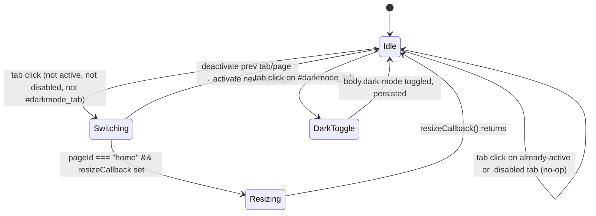

# `main/ui/components/navigation.ts` — Deep Dive

**Generated:** 2026-04-26 by Paige (Tech Writer) for [DEE-37](/DEE/issues/DEE-37) (parent: [DEE-11](/DEE/issues/DEE-11)).
**Group:** E — UI components.
**File:** `main/ui/components/navigation.ts` (365 LOC, TypeScript, strict).
**Mode:** Exhaustive deep-dive (full redo from source).

## 1. Purpose

The renderer's **side-nav controller**. Owns the click behaviour of the
four `<li>` items in `#sidenav` (`home_tab`, `config_tab`, `info_tab`,
`darkmode_tab`) and the `<body>.dark-mode` class. Ractive-free — the
HTML is static and the component only flips classes through the
`dom-utils` helpers.

The implementation is a 1:1 port of `page.js` lines 168–199 (legacy);
the JSDoc header at line 4 names the source explicitly. Behaviour
parity is intentional, so any divergence from the legacy renderer is a
bug.

## 2. Public surface

```ts
export type ResizeCallback = () => void;

export interface NavigationOptions {
  resizeCallback?: ResizeCallback;          // fired on switch to "home"
}

export class NavigationService {
  constructor(options?: NavigationOptions);

  setResizeCallback(callback: ResizeCallback): void;
  initializeDarkMode(): void;
  isDarkMode(): boolean;
  toggleDarkMode(): void;
  enableDarkMode(): void;
  disableDarkMode(): void;
  switchToTab(pageId: string): boolean;     // programmatic switch
  bindEventHandlers(): void;                // idempotent via `initialized`
  initialize(): void;                        // = initializeDarkMode + bind
  getActiveTab(): HTMLLIElement | null;
  getActivePageId(): string | null;
  isTabActive(pageId: string): boolean;
  enableTab(pageId: string): void;
  disableTab(pageId: string): void;
  static create(options?: NavigationOptions): NavigationService;
}

export function createNavigationService(options?: NavigationOptions): NavigationService;
export function initializeNavigation(resizeCallback?: ResizeCallback): NavigationService;
```

The factory `createNavigationService(...)` is the one used by the
composition root (`main/ui/index.ts:610`); `initializeNavigation(...)`
is a same-shot helper provided for one-off scripts and is currently
not consumed in-tree.

### 2.1 DOM contract (Group G)

The class is the consumer side of the contract carried by
`main/index.html`. See [Group G – `main__index.html.md`](../g/main__index.html.md)
for the producer side.

| Surface           | Selector(s)        | HTML line(s) | Notes |
|---|---|---|---|
| Tab list          | `#sidenav li`      | 123–129 | Each `<li>` carries `data-page="<id>"`. `account_tab` is commented out at line 126 (preserved for future re-enablement). |
| Active tab        | `#sidenav li.active` | 124 (`#home_tab`) | Initial active tab is hard-coded in HTML to `home`. |
| Active page       | `.page.active`     | 131 (`#home`) | Pages are siblings under `#main`: `#home`, `#config`, `#info`. |
| Dark-mode trigger | `#darkmode_tab`    | 128     | Special-cased in `handleTabClick` — does NOT participate in tab switching. |
| Dark-mode body class | `<body>.dark-mode` | n/a (added at runtime) | Toggled on click and on init from `localStorage.darkMode`. |

`NavigationService` does not own a Ractive template. The HTML markup
is static; only class names change.

### 2.2 State machine



Key transitions in code:

- **Click on a tab** → `bindEventHandlers()` line 254 →
  `handleTabClick(tab)` (lines 196–240).
  - If `tab.id === "darkmode_tab"` → `toggleDarkMode()` and return.
  - If `tab.className === "active"` or `"disabled"` → return `false`
    (no-op).
  - Otherwise: deactivate the current `#sidenav li.active` and
    `.page.active`, activate the new tab + corresponding `#<data-page>`
    element.
- **`pageId === "home"`** is the only branch that fires
  `resizeCallback()` (line 233). The home page hosts the parts list and
  needs the drag-resize handle re-measured.
- **`switchToTab(pageId)`** (line 147) mirrors the click handler but is
  callable from outside (programmatic). Same active/disabled guards
  apply (lines 158–163).

## 3. IPC / global side-effects

| Trigger | Effect |
|---|---|
| `initialize()` (line 267) | Reads `localStorage.darkMode` and conditionally adds `dark-mode` to `<body>` (line 102). |
| Click on `#darkmode_tab` (line 198) | Toggles `<body>.dark-mode` and writes `localStorage.darkMode` (lines 119–123). |
| Click on a normal tab | Mutates classes on the tab, the previous active tab, the matching `.page` element, and the previously active page (lines 165–186 / 211–236). |
| Switch to `#home` (line 233) | Calls `resizeCallback?.()` synchronously. |

**No** IPC channels, **no** network access, **no** `window.DeepNest`
or `window.config` reads. The class is a pure DOM controller.

## 4. Dependencies

| Import | Why |
|---|---|
| `../utils/dom-utils.js` (`getElement`, `getElements`, `addClass`, `removeClass`, `toggleClass`, `hasClass`) | All DOM access goes through these helpers. See [`docs/deep-dive/f/main__ui__utils__dom-utils.ts.md`](../f/main__ui__utils__dom-utils.ts.md). |

No service from `main/ui/services/` is consumed. The component is a
leaf and does not import any peer component. No vendored library
import (Ractive, svg-pan-zoom, interact, etc.).

### 4.1 Inbound dependency (composition root)

`main/ui/index.ts:610-611`:

```ts
navigationService = createNavigationService({ resizeCallback: resize });
navigationService.initialize();
```

`resize` is the `resize()` function defined in `index.ts` (re-measures
the parts panel after a layout change). `navigationService` is then
re-exported as a named binding of the `index.ts` module
(`index.ts:818`). Navigation is otherwise standalone.

## 5. Invariants & gotchas

- **Direct `className` writes wipe other classes.** Lines 170, 173,
  177, 216, 219, 223 set `tab.className = "..."` rather than calling
  `addClass`/`removeClass`. This is intentional: it clears any prior
  class so only one of `active` / `disabled` / `""` is present. Any
  future code that adds a persistent class to a `<li>` in `#sidenav`
  must refactor those writes to `addClass`/`removeClass` first.
- **`localStorage` write is synchronous on every toggle** (lines 121,
  131, 139). No debounce. The value is the **string** `"true"` /
  `"false"`, written by `Boolean.toString()`. Don't migrate to
  `JSON.parse` — existing users have the string form persisted.
- **Listener registration is idempotent but additive.** `bindEventHandlers()`
  guards itself with `this.initialized` (lines 247–249) and never
  removes listeners. If the `#sidenav` DOM is re-rendered after
  `initialize()`, the old listeners stay attached to detached nodes —
  re-create the service rather than re-binding.
- **`event.preventDefault()` runs on every tab click** (line 255). If
  the markup ever places a real `<a href="…">` inside an `<li>`, that
  link will not navigate.
- **`#darkmode_tab` is matched by exact id** (`tab.id === SPECIAL_TABS.DARK_MODE`,
  line 198). Renaming the id silently breaks the dark-mode toggle —
  `handleTabClick` would treat the click as a regular tab switch and
  try to find a page with `data-page=""`, which fails harmlessly but
  also stops toggling the theme.
- **`switchToTab` returns `false` for missing/active/disabled tabs**
  (lines 154, 162) but does **not** report which case it was. Callers
  needing finer-grained signalling should call `getActivePageId()` or
  `isTabActive(pageId)` first.
- **`activeTab.className = ""`** (line 170) wipes the
  `.active` class on the previously active tab, but the corresponding
  page also has its class reset to the constant `"page"` (line 173)
  — not removed. The HTML invariant is that every page sibling under
  `#main` carries the `page` class at all times.
- **Order matters in `initialize()`.** `initializeDarkMode()` runs
  *before* `bindEventHandlers()` (lines 268–269). That order is
  required so that the `<body>.dark-mode` class is set before any
  CSS that depends on it can flash a wrong-theme paint.

## 6. Known TODOs

None in source. The class has no `// TODO` or `// FIXME` comments.
The JSDoc header at line 4 references the legacy origin
(`page.js` lines 168–199) but is not actionable.

## 7. Extension points

- **New tab.** Add the `<li id="<n>_tab" data-page="<n>">` in
  `main/index.html` (after line 128, sibling under `#sidenav`) and a
  corresponding `<div id="<n>" class="page">` (sibling of `#home` /
  `#config` / `#info`, lines 131 / 210 / 3345). No code change here —
  the click handler enumerates `#sidenav li` at bind time.
- **Programmatic tab switch.** Call
  `navigationService.switchToTab("config")`. Use
  `isTabActive("config")` first if you only want to switch when not
  already active.
- **Disable/re-enable a tab at runtime.** Use `disableTab(pageId)` /
  `enableTab(pageId)` (lines 302, 315). The CSS class `disabled` on
  the tab is the in-memory contract; `handleTabClick` and
  `switchToTab` both early-return on it (lines 159, 205).
- **Replace dark-mode persistence (e.g. roll into `ConfigService`).**
  Wrap the four `localStorage` reads/writes (lines 100, 121, 131, 139)
  in a strategy interface; the cheapest seam is to inject a
  `darkModePersistence: { load(): boolean; save(v: boolean): void }`
  via `NavigationOptions`.
- **Hook into tab switches.** Today the class fires `resizeCallback`
  only for `home`. Generalise to `onTabSwitch(pageId)` if more
  observers are needed; keep the `home`-resize special case for
  backwards compatibility.

## 8. Test coverage

- **Unit tests:** none in repo. The renderer UI is covered exclusively
  by Playwright E2E tests; see
  [`docs/deep-dive/j/tests__index.spec.ts.md`](../j/tests__index.spec.ts.md)
  and `docs/architecture.md` §6.
- **E2E coverage:** `tests/specs/`'s config-tab and dark-mode flows
  exercise the click handlers indirectly. The Config Tab E2E test
  (`tests/specs/config-tab.spec.ts`) is the canonical smoke test for
  tab switching — re-run it on Linux and Windows after touching the
  click handler.
- **Manual verification checklist:** launch the app via `npm start`,
  click each tab including `#darkmode_tab`, reload the renderer, and
  confirm the dark-mode preference persists; confirm the parts list
  re-measures correctly when switching back to `home`.

## 9. Cross-references

- **Group D (services):** none consumed. Components are leaves; the
  `Used-by` slot is empty by design.
- **Group F (composition root + utilities):** wired in
  [`main/ui/index.ts:610`](../c/main__ui__index.ts.md). The `resizeCallback`
  injected here is the only seam.
- **Group G (`main/index.html`):** owner of selectors `#sidenav`,
  `#sidenav li`, `#darkmode_tab`. Page sibling ids referenced via
  `data-page`: `home`, `config`, `info`. See
  [`docs/deep-dive/g/main__index.html.md`](../g/main__index.html.md)
  §3.4 (`data-page` attribute table).
- **Component inventory:** [`docs/component-inventory.md`](../../component-inventory.md)
  row "NavigationService".
- **Architecture:** [`docs/architecture.md`](../../architecture.md) §3
  (renderer composition).
