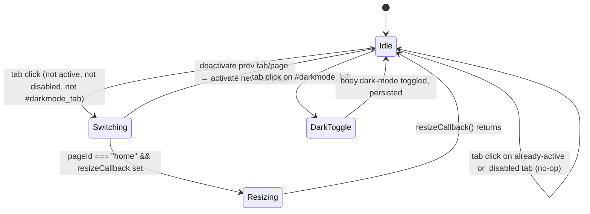

# `main/ui/components/navigation.ts` — Deep Dive

**Generated:** 2026-04-25 by Paige (Tech Writer) for [DEE-16](/DEE/issues/DEE-16) (parent: [DEE-11](/DEE/issues/DEE-11)).
**Group:** E — UI components.
**File:** `main/ui/components/navigation.ts` (366 LOC, TypeScript, strict).
**Mode:** Exhaustive deep-dive.

## Overview

Top-level tab/view switcher for the renderer. Owns the **side nav state machine** (`#sidenav` `<li>` elements with `.active`/`.disabled` CSS state) and the **dark-mode toggle** persisted in `localStorage`. Ractive-free — manipulates the DOM directly through the `dom-utils` helpers.

Originally extracted from `page.js` lines 168–199 (legacy), so behaviour is intentionally one-to-one with the pre-TypeScript renderer.

## DOM contract (Group G)

| Surface | Selector(s) | Owner | Notes |
|---|---|---|---|
| Tab list | `#sidenav li` | `NavigationService` | Each `<li>` declares `data-page="<id>"` for the page it controls. Source: `main/index.html` lines 123–129. |
| Active tab | `#sidenav li.active` | `NavigationService` | Initial active tab is hard-coded in HTML to `#home_tab`. |
| Active page | `.page.active` | `NavigationService` | Pages are siblings under `#main`: `#home`, `#config`, `#info`. |
| Dark-mode trigger | `#darkmode_tab` | `NavigationService` | Special-cased in `handleTabClick` — does NOT participate in tab switching. |
| Dark-mode body class | `<body>.dark-mode` | `NavigationService` | Toggled on click and on init from `localStorage.darkMode`. |

`NavigationService` does **not** own a Ractive template. The HTML markup is static; only class names change.

## Public surface

```ts
class NavigationService {
  constructor(options?: NavigationOptions);
  setResizeCallback(callback: ResizeCallback): void;
  initializeDarkMode(): void;
  isDarkMode(): boolean;
  toggleDarkMode(): void;
  enableDarkMode(): void;
  disableDarkMode(): void;
  switchToTab(pageId: string): boolean;     // programmatic tab switch
  bindEventHandlers(): void;                 // idempotent; sets `initialized`
  initialize(): void;                        // initializeDarkMode + bindEventHandlers
  getActiveTab(): HTMLLIElement | null;
  getActivePageId(): string | null;
  isTabActive(pageId: string): boolean;
  enableTab(pageId: string): void;
  disableTab(pageId: string): void;
  static create(options?: NavigationOptions): NavigationService;
}
export function createNavigationService(options?: NavigationOptions): NavigationService;
export function initializeNavigation(resizeCallback?: ResizeCallback): NavigationService;
```

`NavigationOptions` carries a single optional callback:

```ts
interface NavigationOptions { resizeCallback?: () => void; }
```

## State machine



Key transitions in code:

- **Click on a tab** → `bindEventHandlers()` line 254 → `handleTabClick(tab)` (lines 196–240).
  - If `tab.id === "darkmode_tab"` → `toggleDarkMode()` and return.
  - If `tab.className === "active"` or `"disabled"` → return `false` (no-op).
  - Otherwise: deactivate the current `#sidenav li.active` and `.page.active`, activate the new tab + corresponding `#<data-page>` element.
- **`pageId === "home"`** is the only branch that fires `resizeCallback()`. The home page hosts the parts list and needs the drag-resize handle re-measured.
- **`switchToTab(pageId)`** mirrors the click handler but is callable from outside (programmatic). Same active/disabled guards apply.

## Dependencies

| Import | Why |
|---|---|
| `../utils/dom-utils.js` (`getElement`, `getElements`, `addClass`, `removeClass`, `toggleClass`, `hasClass`) | All DOM access goes through these helpers. |

No service from `main/ui/services/` is consumed. The component is a pure DOM controller.

## Wired-in dependencies (from composition root)

`main/ui/index.ts:610`:

```ts
navigationService = createNavigationService({ resizeCallback: resize });
navigationService.initialize();
```

`resize` is the `resize()` function defined in `index.ts` (re-measures the parts panel after a layout change). Navigation is otherwise standalone.

## Direct DOM manipulation that bypasses Ractive

The whole component bypasses Ractive — there is no template. Things to know:

- **Direct `className` writes** (lines 170, 173, 177, 216, 219, 223). Setting `tab.className = "active"` (rather than `addClass`) is intentional: it clears any prior class. **Be careful**: any class the HTML or another module added to the tab will be lost on tab switch.
- **`localStorage` write** for `darkMode` happens synchronously on every toggle (lines 121, 131, 139). No debounce.
- **Event handler is registered with `event.preventDefault()`** (line 255). Adding native links inside `<li>` markup will not navigate.

## Side effects

| Trigger | Effect |
|---|---|
| `initialize()` | Reads `localStorage.darkMode` and conditionally adds `dark-mode` to `<body>`. |
| Click on `#darkmode_tab` | Toggles `<body>.dark-mode` and writes `localStorage.darkMode`. |
| Click on a normal tab | Mutates classes on the tab, the previous active tab, the matching `.page` element, and the previously active page. |
| Switch to `#home` | Calls `resizeCallback?.()` synchronously. |

No IPC, no network, no `window.DeepNest` access.

## Error handling

Defensive nulls: every `getElement` call is null-checked before use. `switchToTab` returns `false` when the requested tab is missing/active/disabled, giving callers an explicit failure signal. There is **no** error reporting beyond the boolean return — no `message()` banner.

## Testing

- **Unit tests**: none in repo (UI tested via Playwright E2E only — see `architecture.md` §6).
- **E2E coverage**: `tests/specs/`'s config-tab/dark-mode flows exercise the click handlers indirectly. Manual verification: run `npm start`, click each tab, click the moon/sun icon.

## Comments / TODOs in source

None. The class is fully JSDoc-annotated and contains no `TODO`/`FIXME` markers.

## Contributor checklist

**Risks & gotchas:**

- The `tab.className = "active"` writes (lines 170, 173, 177, 216, 219, 223) **wipe other classes**. If you ever need to add a persistent class to a `<li>` in `#sidenav`, refactor those writes to `addClass`/`removeClass` first.
- `bindEventHandlers()` is idempotent via `this.initialized`, but it does NOT remove existing listeners — calling `initialize()` after the DOM is wiped won't re-bind. Re-create the service if you tear down `#sidenav`.
- `switchToTab` does not re-read the disabled state inside the click branch (`handleTabClick`); a tab disabled at runtime via `disableTab(...)` will still no-op correctly because the early `hasClass(targetTab, DISABLED)` guard hits.
- Dark-mode preference is stored as the **string** `"true"`/`"false"`. Don't switch to `JSON.parse` — existing users have the string form in their `localStorage`.
- `#darkmode_tab` MUST keep its exact id; the special-case guard in `handleTabClick` is an `===` string compare on `tab.id`.

**Pre-change verification:**

- `npm run build` (TypeScript strict, will catch most issues).
- Manual: launch the app, switch every tab including `darkmode_tab`, reload — dark-mode preference must persist.
- Confirm the parts list re-measures correctly after switching back to `home` (the `resizeCallback` path).

**Suggested tests before PR:**

- `npm test` (Playwright). The Config Tab E2E test (`tests/specs/config-tab.spec.ts`) is the canonical smoke test for tab switching after the recent fix in [DEE-171](/DEE/issues/171). Re-run it on Linux/Windows if you change the click handler.

## Cross-references

- **Group D (services):** none consumed. (`Used-by` is empty for components — they are leaves.)
- **Group F (composition root):** wired in `main/ui/index.ts:610`. The `resizeCallback` injected here is the only seam.
- **Group G (`main/index.html`):** owns selectors `#sidenav`, `#sidenav li`, `#darkmode_tab`. Page sibling ids referenced by `data-page`: `home`, `config`, `info`.
- **Component inventory:** `docs/component-inventory.md` row "NavigationService".
- **Architecture:** `docs/architecture.md` §3 (renderer composition).

---

_Generated by Paige for the Group E deep-dive on 2026-04-25. Sources: `main/ui/components/navigation.ts`, `main/ui/index.ts`, `main/index.html`._
