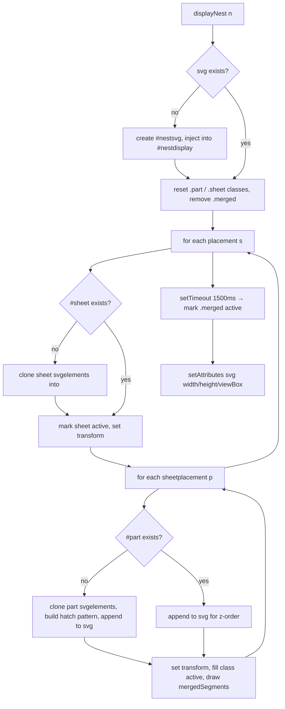

# `main/ui/components/nest-view.ts` — Deep Dive

**Generated:** 2026-04-26 by Paige (Tech Writer) for [DEE-37](/DEE/issues/DEE-37) (parent: [DEE-11](/DEE/issues/DEE-11)).
**Group:** E — UI components.
**File:** `main/ui/components/nest-view.ts` (563 LOC, TypeScript, strict).
**Mode:** Exhaustive deep-dive (full redo from source).

## 1. Purpose

The renderer's **nest-result viewer** for the home tab. Owns:

1. The **Ractive instance** that binds the nest summary
   (`#nestcontent` / `#nest-template`) to `DeepNest.nests` —
   per-nest selection thumbnails, sheet count, parts placed,
   utilisation %, laser-time-saved label.
2. The **SVG renderer** that draws the currently-selected nest into
   `#nestsvg` — sheets, placed parts (with fill-pattern hatching keyed
   on `part.source`), and merged-line laser-cut markers.
3. **Selection wiring**: clicking a thumbnail in the side list
   (`selectnest` Ractive event) deselects the others, marks the new
   nest selected, calls `update()`, and re-renders the SVG via
   `displayNest(...)`.

The implementation is a 1:1 port of `page.js` lines 1463–1697 (legacy);
the JSDoc header at line 4 names the source. Behaviour parity is
intentional, so any divergence from the legacy renderer is a bug.

## 2. Public surface

```ts
export interface NestViewOptions {
  deepNest: DeepNestInstance;        // window.DeepNest
  config: ConfigObject;              // window.config (= ConfigService)
}

export class NestViewService {
  constructor(options: NestViewOptions);

  displayNest(n: SelectableNestingResult): void;     // imperative SVG render
  update(): void;                                     // re-render `nests` keypath
  initialize(): void;                                 // idempotent (Ractive + events)
  getRactive(): NestViewRactiveInstance | null;
  getDisplayNestCallback(): (n: SelectableNestingResult) => void;
  static create(options: NestViewOptions): NestViewService;
}

export function createNestViewService(options: NestViewOptions): NestViewService;
export function initializeNestView(deepNest: DeepNestInstance, config: ConfigObject): NestViewService;
```

`createNestViewService(...)` is the factory used by the composition
root (`main/ui/index.ts:622`). `initializeNestView(...)` is a one-liner
helper currently unused in-tree.

### 2.1 DOM contract (Group G)

| Surface | Selector / id | HTML line(s) | Notes |
|---|---|---|---|
| Container | `#nestcontent` | 90 | Ractive `el`. The `<script id="nest-template" type="text/ractive">` block at lines 93–112 is the template body. |
| Template | `#nest-template` | 93 | Renders the per-nest header tiles (sheets used, parts placed, sheet utilisation, laser-time-saved) and the `#nestlist` thumbnail strip. |
| Display | `#nestdisplay` | 91 | Sibling div that hosts the SVG element. Created by `displayNest()` on first call (lines 174–178). |
| SVG | `#nestsvg` | (created at runtime, line 173) | Owned exclusively by this component. Inserted into `#nestdisplay` once. |
| Sheet group | `#sheet<sheetid>` | (runtime) | One `<g>` per `placement.sheetid`. Carries a `data-index` attribute (line 213) for E2E test selectors. |
| Part group | `#part<id>` | (runtime) | One `<g>` per `sheetplacement.id`. Re-parented for z-order on each `displayNest` call (line 298). |
| Hatch pattern | `#part<source>hatch` | (runtime) | One `<pattern>` per part source, lazily inserted into the parent sheet `<g>` on first encounter (lines 268–293). |
| Merged segments | `#nestsvg .merged` | (runtime) | One `<line>` per `mergedSegments` entry. Cleared on every render (line 199). |

### 2.2 Ractive data and computed shape

```ts
interface NestViewData {
  nests:                SelectableNestingResult[];   // alias of deepNest.nests
  getSelected():        SelectableNestingResult[];   // nests.filter(n => n.selected)
  getNestedPartSources: (n) => number[];             // flattened sheetplacement[].source ids
  getColorBySource:     (id) => string;              // hsl(360 * id/parts.length, 100%, 80%)
  getPartsPlaced:       () => string;                // "<placed>/<total non-sheet quantity>"
  getUtilisation:       () => string;                // selected[0].utilisation.toFixed(2) | "-"
  getTimeSaved:         () => string;                // millisecondsToStr(seconds*1000); cut speed = 2 in/s
}
```

The class does **not** declare a Ractive `computed` block. All
"reactive" values live as `data` functions whose `this` is the Ractive
instance — Ractive treats functions in `data` as
context-aware on first call. This is a quirk of Ractive 0.8 retained
from the legacy renderer; it's why every helper takes `this` typed as
`{ get: (key) => … }`.

### 2.3 Ractive events emitted by the template

| Event | Argument | Handler | Notes |
|---|---|---|---|
| `selectnest` | `SelectableNestingResult` | line 461 | Marks `n.selected = true`, deselects every other entry of `deepNest.nests`, calls `update()` then `displayNest(n)`. |

The template fires `selectnest` from `<span class="nest …" on-click="selectnest:{{this}}">`
(HTML line 102) — clicking any thumbnail in `#nestlist`.

### 2.4 SVG render pipeline



Layout of multiple sheets: each subsequent sheet is offset down by
`1.1 * sheetBounds.height` (line 336) — a 10% gap.

## 3. IPC / global side-effects

| Trigger | Effect |
|---|---|
| `displayNest()` first call | Inserts `#nestsvg` into `#nestdisplay` via `setInnerHtml(serializeSvg(...))` (line 176). Subsequent calls reuse the same DOM node. |
| `displayNest()` per-render | Mutates classes on every `.part` / `.sheet` inside `#nestsvg`; removes every `.merged` line (lines 187–200). Clones SVG elements out of `deepNest.parts[i].svgelements` (lines 218 / 251) — read-only with respect to the source array. |
| `displayNest()` per-render | Sets `viewBox` on `#nestsvg` to `"0 0 <svgWidth> <svgHeight>"` based on the sum of sheet bounds (line 351). |
| `displayNest()` per-render | `setTimeout(..., 1500)` (line 340) — flips merged lines to `active` after a 1.5 s animation delay. The timer is **not** cancelled on subsequent renders. |
| `selectnest` Ractive event | Mutates `deepNest.nests[i].selected` for every entry (lines 467–472). |
| Composition root (`index.ts:629`) | Sets `window.nest = nestViewService.getRactive()` for backwards compatibility with the legacy `page.js`-era code. |
| `NestingService` callbacks | `displayNestFn = nestViewService.getDisplayNestCallback()` (`index.ts:684`) and `nestRactive = nestViewService.getRactive()` (`index.ts:689`) connect this component to the worker pipeline; the `NestingService` calls `displayNestFn(latestNest)` whenever a nest improves and `nestRactive.update("nests")` after every list mutation. |

**No** IPC channels and **no** network access. Reads
`config.getSync("scale")` synchronously (line 439) — an in-memory cache
hit in `ConfigService`, not an IPC round-trip.

## 4. Dependencies

| Import | Why |
|---|---|
| `../types/index.js` (`Part`, `Bounds`, `DeepNestInstance`, `ConfigObject`, `SelectableNestingResult`, `SheetPlacementWithMerged`) | Type-only imports for the data model. |
| `../utils/dom-utils.js` (`getElement`, `getElements`, `createSvgElement`, `setAttributes`, `serializeSvg`, `setInnerHtml`, `createTranslate`, `createCssTransform`) | All DOM access, plus the `transform` / `style: transform: …` builders. |
| `../utils/ui-helpers.js` (`millisecondsToStr`) | Time-saved label formatting. |
| Vendored `Ractive` (declared globally in `main/index.html`'s classic `<script>` block) | Templated rendering. |

The component reaches `DeepNest` and `ConfigService` only through the
constructor-injected `options.deepNest` / `options.config`. **No**
direct `window.DeepNest` / `window.config` read inside this file.

### 4.1 Inbound dependencies (composition root)

`main/ui/index.ts:622-629`:

```ts
nestViewService = createNestViewService({
  deepNest: getDeepNest(),
  config: configService as unknown as ConfigObject,
});
nestViewService.initialize();
(window as ...).nest = nestViewService.getRactive();
```

`window.nest` is the same Ractive instance returned by
`getRactive()` — exposed for legacy callers that pre-date the service
seam.

`main/ui/index.ts:684-691`:

```ts
displayNestFn: nestViewService.getDisplayNestCallback(),
const nestRactive = nestViewService.getRactive();
nestingService.setNestRactive(nestRactive as ...);
```

These two lines are the seam between the nest-view component and
`main/ui/services/nesting.service.ts` — the worker pipeline calls
the bound `displayNest` whenever a new best nest arrives.

### 4.2 Used-by

| Caller | Method | Line |
|---|---|---|
| `main/ui/index.ts` (composition root) | `getRactive()`, `getDisplayNestCallback()` | 629 / 684 / 689 |
| `main/ui/services/nesting.service.ts` (`displayNestFn`) | `displayNest` (bound) | nesting.service.ts:410 / 634 |
| `main/ui/services/nesting.service.ts` (`setNestRactive`) | `update("nests")` (via the Ractive ref) | nesting.service.ts:168 |
| `window.nest` (legacy globals) | full Ractive surface | renderer code outside `main/ui/` |

## 5. Invariants & gotchas

- **`#nestsvg` is created lazily and never destroyed.** Lines 169–179
  insert it into `#nestdisplay` once; subsequent renders reuse the
  same SVG node. If `#nestdisplay` is wiped externally, `displayNest`
  will rebuild on the next call (the early-out at line 181 catches
  the failure case).
- **Hatch patterns leak across sheet boundaries.** A
  `<pattern id="part<source>hatch">` is appended to whichever
  sheet `<g>` happens to be processed first (line 292). The
  pattern lives within the sheet group's coordinate space; SVG
  references work across the whole `<svg>`, so this is functionally
  correct but visually surprising — patterns added on sheet 1 still
  render on parts placed on sheet 2.
- **Hatch pattern size is hard-coded.** `psize = parseInt(sheet.bounds.width / 120) || 10`
  (line 273). For tiny sheets (width < 120) the fallback `10` kicks
  in, which can produce coarse hatching on small-sheet nests.
- **`hsl(...)` colour palette wraps on `parts.length`.** Line 285
  computes `hue = 360 * (p.source / parts.length)`, so adding or
  removing a part shifts every part's colour. Colours are not
  stable across edits.
- **Cut-speed assumption is hard-coded.** `getTimeSaved()` divides
  `lengthInches` by `2` (line 443) — the legacy assumption is
  "2 inches per second of laser cut speed". This is comments-free in
  source; the assumption belongs in a config field.
- **`selectnest` mutates `deepNest.nests` in place.** The handler at
  lines 467–472 walks the array, sets `selected = false`, then sets
  the clicked entry's `selected = true`. Concurrent writers (e.g.
  the worker loop appending a new improved nest) must not race this
  mutation — Ractive's `update("nests")` re-reads the array, so
  out-of-order writes can flicker the selection.
- **Per-render `setTimeout(1500)` accumulates.** Line 340 schedules a
  delayed class flip on every `displayNest` call without clearing
  the previous timer. Rapid-fire renders queue multiple timers; the
  effect is benign (idempotent class write) but represents a leak
  shoulder.
- **Z-order management.** Existing parts are re-appended to `svg`
  each render (line 298) so they end up on top in the order they
  appear in `placements`. Adding intermediate `<g>` parents would
  break this ordering — keep parts as direct children of `#nestsvg`.
- **`partElement.setAttribute("style", "transform: …")`** (line 309)
  — using inline-style transform rather than the SVG `transform`
  attribute is intentional for hardware-accelerated paint, but means
  the part's transform cannot be read back via `getAttribute("transform")`.
- **`removeAttribute("style")` is called on cloned nodes** (lines
  222, 259) to strip whatever inline styling came from the imported
  SVG. If imports ever rely on inline `style="fill:…"`, this strip
  will silently lose the fill.
- **`stroke="#ffffff"` is hard-coded.** Lines 220 and 260 set white
  stroke on every part. The visual style is intentional for the
  current dark canvas, but a future dark-mode/light-mode split must
  drive the stroke from a CSS variable, not a literal.
- **Ractive 0.8 `data: { fn() { … } }` quirk.** The five `get*`
  helpers in `data` (lines 367–445) are Ractive-aware by accident —
  Ractive 0.8 calls them with `this = ractive`. A migration to
  Ractive 1.x or a different framework needs to move them to
  `computed`.
- **`getRactive()` returns the same instance forever.** Once
  `initialize()` runs, the Ractive is never destroyed. Calling
  `initialize()` twice is a no-op via the `initialized` guard
  (line 495).

## 6. Known TODOs

None in source. No `// TODO` or `// FIXME` markers.

Implicit TODOs surfaced by this deep dive (not in source):

- Move the cut-speed constant (line 443) into `UIConfig` so users
  can override "2 in/s".
- Cancel the previous merged-line `setTimeout` (line 340) before
  scheduling a new one.
- Move the data-helper functions (lines 367–445) from `data` to
  `computed` to lock the Ractive 0.8 implicit binding behind an
  explicit Ractive contract.

## 7. Extension points

- **New header tile in the nest summary.** Add the markup inside
  `<script id="nest-template">` (HTML line 93) and a corresponding
  helper in the Ractive `data` block (lines 367–445).
- **Custom render strategy.** `displayNest` is the seam — replace it
  end-to-end if a non-SVG renderer (Canvas, WebGL) is needed. The
  surface contract is: render `n.placements` on top of `#nestdisplay`,
  preserving id conventions `#sheet<sheetid>` / `#part<id>` so that
  E2E tests keep working.
- **Add a per-nest action.** Declare a new event in the Ractive
  template (e.g. `on-click="exportnest:{{this}}"`) and bind it next to
  `selectnest` in `bindRactiveEvents()` (line 461).
- **Replace Ractive.** The component touches Ractive at three points:
  the `Ractive` global declaration (line 60), `new Ractive(...)`
  (line 363), and `this.ractive.on(...)` (line 461). A drop-in
  replacement only needs the `update`, `get`, `set`, `on` methods
  from `NestViewRactiveInstance`.

## 8. Test coverage

- **Unit tests:** none in repo. Renderer UI is covered exclusively by
  Playwright E2E tests; see
  [`docs/deep-dive/j/tests__index.spec.ts.md`](../j/tests__index.spec.ts.md)
  and `docs/architecture.md` §6.
- **E2E coverage:** `tests/specs/` exercises full nest → display →
  thumbnail-select; the `data-index` attribute on `#sheet<id>` (line
  213) is the canonical Playwright selector.
- **Manual verification checklist:**
  1. Run a nest end-to-end. The summary tiles fill in
     (sheets, parts placed, utilisation, laser-time-saved).
  2. Confirm `#nestsvg` is created and shows hatch-shaded parts on
     each sheet.
  3. Click a thumbnail in `#nestlist` — the selected nest re-renders
     in `#nestsvg` and the previously-selected thumbnail loses its
     `active` class.
  4. After 1.5 seconds, the merged-line markers should fade in
     (`.merged.active` flip from the `setTimeout`).
  5. Switch units in `#config` (mm ↔ inch). Re-display the nest. The
     `getTimeSaved()` label uses `scale` directly so the laser-time
     does not change with units (the math is in inches/second).
     **Don't** expect the time tile to change with units — that is
     intentional.

## 9. Cross-references

- **Group D (services):**
  - [`nesting.service.ts`](../d/main__ui__services__nesting.service.ts.md)
    holds `displayNestFn` (a bound `displayNest`) and the Ractive
    instance, calling them on every worker improvement.
  - [`config.service.ts`](../d/main__ui__services__config.service.md)
    is queried for `scale` in `getTimeSaved()`.
- **Group E peers:** none. Components are leaves; the parts-view and
  sheet-dialog do not consume nest-view.
- **Group F (utilities):**
  [`dom-utils.ts`](../f/main__ui__utils__dom-utils.ts.md) (transform
  builders),
  [`ui-helpers.ts`](../f/main__ui__utils__ui-helpers.ts.md)
  (`millisecondsToStr`).
- **Group G (`main/index.html`):** owner of `#nestcontent`,
  `#nest-template`, `#nestdisplay`, `#nestlist`. See
  [`docs/deep-dive/g/main__index.html.md`](../g/main__index.html.md).
- **Composition root:** [`main/ui/index.ts`](../c/main__ui__index.ts.md) §6.
- **Component inventory:** [`docs/component-inventory.md`](../../component-inventory.md)
  row "NestViewService".
- **Architecture:** [`docs/architecture.md`](../../architecture.md) §3
  (renderer composition), §4 (worker pipeline).
