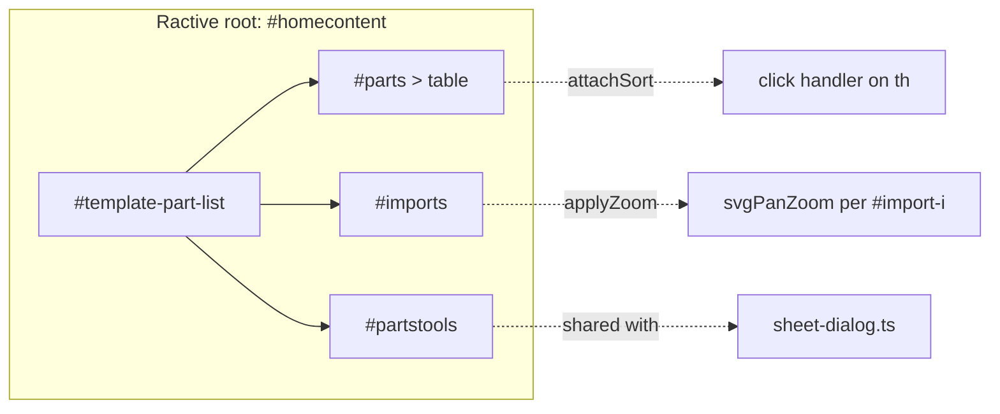

# `main/ui/components/parts-view.ts` — Deep Dive

**Generated:** 2026-04-25 by Paige (Tech Writer) for [DEE-16](/DEE/issues/DEE-16) (parent: [DEE-11](/DEE/issues/DEE-11)).
**Group:** E — UI components.
**File:** `main/ui/components/parts-view.ts` (751 LOC, TypeScript, strict).
**Mode:** Exhaustive deep-dive.

## Overview

The imported-parts panel and its per-part configuration UI. Mounts a Ractive instance on `#homecontent` from the inline template `#template-part-list` (declared in `main/index.html` lines 134–207). Owns:

- the **parts table** with sort, multi-select (drag + click + select-all), per-row quantity + sheet toggle, and a hatched SVG thumbnail per part;
- the **imports gallery** below the table — one tab per imported file, each with a `svg-pan-zoom` viewer and zoom controls;
- a delete handler bound to keyboard `Delete`/`Backspace` and the toolbar trash button;
- a custom `<dimensionLabel>` Ractive sub-component that converts part bounds to mm or inches according to `config.units` / `config.scale`.

It does **not** push to `window.DeepNest` directly. Instead it reads `deepNest.parts` and `deepNest.imports` (the legacy `main/deepnest.js` mutates these arrays during import), then drives Ractive `update("parts")` / `update("imports")` to re-render. Net writes happen via `togglePart()` setting `part.selected` and `deleteParts()` splicing the array.

Originally extracted from `page.js` lines 421–714.

## Ractive contract (Group G)

| Surface | Selector | Role |
|---|---|---|
| Mount root | `#homecontent` | Ractive `el` — content wholly replaced by Ractive on init. |
| Template | `#template-part-list` (inline `<script type="text/ractive">`) | Source HTML for the parts list, table, imports gallery, and the toolbar that **also hosts the sheet dialog**. |
| Parts table headers | `#parts table thead th` | Sort handles. `data-sort-field` attribute selects the `Part` field. |
| Imports container | `#imports`, per-import `#import-{i}` | Owned by the template; populated by Ractive `{{#each imports:i}}` block. |
| Sub-component | `<dimensionLabel/>` | Created via `Ractive.extend()` inside `createLabelComponent()`. Re-renders on `getUnits` change. |

Important: the `#partstools` element inside the parts-list template is the **same DOM node** that `sheet-dialog.ts` toggles via `addClass(el, "active")`. The two components share the node — `#partstools` is rendered by Ractive once, but its `.active` class is mutated by sheet-dialog without going through Ractive.



## Public surface

```ts
class PartsViewService {
  constructor(options: PartsViewOptions);
  setResizeCallback(callback: ResizeCallback): void;
  applyZoom(): void;             // (re)bind svg-pan-zoom to selected import
  deleteParts(): void;            // remove selected parts; updates UI
  attachSort(): void;             // bind sort handlers to table headers
  update(): void;                 // ractive.update("parts")
  updateImports(): void;          // ractive.update("imports")
  updateUnits(): void;            // ractive.update("getUnits")
  initialize(): void;             // idempotent
  getRactive(): PartsViewRactiveInstance | null;
  refresh(): void;                // update + updateImports + attachSort + applyZoom + resizeCallback
  static create(options: PartsViewOptions): PartsViewService;
}
export function createPartsViewService(options): PartsViewService;
export function initializePartsView(deepNest, config, resizeCallback?): PartsViewService;
```

`PartsViewOptions`:

```ts
interface PartsViewOptions {
  deepNest: DeepNestInstance;     // window.DeepNest (legacy global)
  config: ConfigObject;           // window.config-shaped service
  resizeCallback?: ResizeCallback;
}
```

## Ractive view model

`new Ractive({ el, template, data, computed, components })`:

| Key | Source | Purpose |
|---|---|---|
| `parts` | `deepNest.parts` (live ref) | Bound to the `<tr on-mouseenter-mousedown="selecthandler:{{this}}">` rows. |
| `imports` | `deepNest.imports` (live ref) | Bound to `#importsnav` and the `#import-{i}` containers. |
| `getSelected()` | data fn | Returns `parts.filter(selected)`. Used by toolbar disabled-state and `selectall`. |
| `getSheets()` | data fn | Returns `parts.filter(sheet)`. Toolbar uses this to disable the **Start nest** button when no sheet exists. |
| `serializeSvg(svg)` | data fn | Wraps `dom-utils.serializeSvg` for use inside `{{{ }}}` triple-mustache. |
| `partrenderer(part)` | data fn | Builds an SVG thumbnail with a `viewBox` padded by 5 around `part.bounds`. Each child element is `cloneNode(false)`. |
| `getUnits` | computed | Reads `config.getSync("units")` → `"mm"` or `"in"`. The `<dimensionLabel>` component depends on this. |
| `dimensionLabel` | sub-component | Computed `label` reads `bounds`, `config.getSync("units")`, `config.getSync("scale")` and emits e.g. `"123.4mm x 56.7mm"`. |

`Ractive.DEBUG = false` is set inside `initializeRactive()` (line 478). The composition root also sets it once in `index.ts`; setting it again here is defensive.

## Events emitted by the template

The template uses Ractive's `on-<event>:<context>` proxy syntax. Handlers wired in `bindRactiveEvents()`:

| Event | Trigger | Behaviour |
|---|---|---|
| `selecthandler` | `<tr on-mouseenter-mousedown="selecthandler:{{this}}">` | If event target is `<input>`, propagate. Otherwise, if `mouseDown > 0` or original event is `mousedown`, toggle `part.selected`, then `update("parts")` and run a 500 ms-throttled `updateImports + applyZoom`. |
| `selectall` | `#selectall` button | Counts selected parts; if count < total, select all (toggling each), else deselect all. Updates parts + imports, re-applies zoom. |
| `importselecthandler` | `<li on-click="importselecthandler:{{this}}">` per import tab | Deselects all imports, selects clicked one, `update("imports")` and `applyZoom()`. Returns `false` if the import is already selected (no-op). |
| `importdelete` | `<a on-click="importdelete:{{this}}">` close icon on the import tab | Splices the import out, falls through to next or index 0, marks it selected, updates imports, re-applies zoom. |
| `delete` | toolbar trash `<a on-click="delete">` | Calls `deleteParts()`. |

## Direct DOM manipulation that bypasses Ractive

This component is the **largest source of Ractive-bypass code in the renderer** — known foot-gun. Touch with care:

1. **`document.body.onmousedown` / `document.body.onmouseup`** (lines 541, 544) — drag tracking for multi-select. Replaces any prior body-level handler. If anything else needs body mouse events, this WILL clobber it.
2. **`document.body.addEventListener("keydown", ...)`** (line 657) — global delete handler. Fires for `keyCode === 8 || 46` regardless of which view is active. Returning to the parts view is not required for delete to fire.
3. **`svgPanZoom("#import-${i} svg", ...)`** (line 294) — initialised against the SVG injected by Ractive. State (`importItem.zoom`) is captured BEFORE re-init and re-applied after, otherwise zoom resets on every parts/imports update.
4. **`removeFromParent(node)`** in `deleteParts()` (lines 372–378) — removes the original imported SVG nodes from their parent (i.e., the off-screen import scratch). The Ractive update on `parts` then re-draws thumbnails, but the source SVG is gone.
5. **`togglePart` mutates `part.svgelements[i]`** (lines 262–270) directly — sets/removes `class="active"` on the imported SVG nodes themselves so that when the import gallery re-renders, the highlight survives. This couples DOM state to model state.
6. **Zoom-control click handlers** (`#import-${i} .zoomin`/`.zoomout`/`.zoomreset`, lines 324–362) are bound during `applyZoom()` — every re-application **re-binds** these handlers. As long as `applyZoom` always fires after re-rendering imports, this is fine; if you ever decouple them, you will leak handlers.

## Dependencies

| Import | Why |
|---|---|
| `../types/index.js` | `Part`, `ImportedFile`, `Bounds`, `DeepNestInstance`, `ConfigObject`, `SvgPanZoomInstance`. |
| `../utils/dom-utils.js` | `getElement`, `getElements`, `createSvgElement`, `serializeSvg`, `removeFromParent`, `setAttributes`. |
| `../utils/ui-helpers.js` | `throttle` (used to throttle `updateImports + applyZoom` on selection drag). |
| Globals (declared, runtime-injected) | `Ractive` (script tag in `main/index.html`), `svgPanZoom` (vendored). |

No service from `main/ui/services/` is consumed.

## Wired-in dependencies (from composition root)

`main/ui/index.ts:614`:

```ts
partsViewService = createPartsViewService({
  deepNest: getDeepNest(),
  config: configService as unknown as ConfigObject,
  resizeCallback: resize,
});
partsViewService.initialize();
```

The Ractive instance is then passed to **`ImportService`** (Group D) at `index.ts:652` so the import service can call `ractive.update("imports")` after a successful import:

```ts
ractive: partsViewService.getRactive() as unknown as RactiveInstance<PartsViewData>,
attachSortCallback: () => partsViewService.attachSort(),
applyZoomCallback: () => partsViewService.applyZoom(),
```

`SheetDialogService` receives `updatePartsCallback: () => partsViewService.update()` at `index.ts:636`. So:

- **Group D ➜ E:** `ImportService` and `SheetDialogService` push into `PartsViewService` via the wired callbacks.
- **E ➜ no service:** `PartsViewService` itself only consumes `DeepNestInstance` and `ConfigObject`.

## Side effects

| Trigger | Effect |
|---|---|
| `initialize()` | Sets `Ractive.DEBUG = false`, builds Ractive tree under `#homecontent` (replaces existing markup), registers body-level mouse + keyboard listeners. |
| Selection (`selecthandler`) | Mutates `part.selected` and `part.svgelements[*].class`. |
| `deleteParts()` | Splices `deepNest.parts`, removes SVG nodes, updates Ractive twice, re-applies zoom, fires `resizeCallback`. |
| `attachSort` click | Mutates `deepNest.parts` order in place, mutates header CSS classes for sort indicator, updates Ractive. |
| `applyZoom()` | Mutates `importItem.zoom` (svg-pan-zoom instance) on each selected import. |
| `selectall` | Calls `togglePart` for each part — also mutates SVG classes. |

No IPC. No network. No `localStorage`.

## Error handling

The component is permissive: most paths use optional chaining (`importItem.zoom?.zoomIn()`) and length checks (`if (this.deepNest.imports.length === 0) return`). Sort comparators short-circuit on `undefined`/`null` rather than throwing.

There is **no** user-facing error reporting (no `message(...)` calls). Failures (e.g. a malformed `Part`) silently no-op.

## Testing

- **Unit tests**: none.
- **E2E**: `tests/specs/` covers import → select → start nest. The parts table is exercised end-to-end; sort and zoom controls are not in the current Playwright suite (verify manually).

## Comments / TODOs in source

None. The file has dense JSDoc but no inline `TODO`/`FIXME`.

## Contributor checklist

**Risks & gotchas:**

- **Body-level handlers clobber.** If you add another module that registers `document.body.onmousedown`, you will break drag-select here. Use `addEventListener` everywhere instead, and migrate this file when you can.
- **Delete key fires globally.** Pressing Delete in any input outside the parts table will currently NOT trigger `deleteParts()` — Ractive handles `<input>` events first via `selecthandler`'s `INPUT` short-circuit. But pressing Delete with focus on, say, the dark-mode toggle WILL delete selected parts. Audit before adding new global focusable controls.
- **`partrenderer` builds SVG every render.** For thousands of parts this is expensive. The Ractive update on `"parts"` re-runs the function for every row.
- **`applyZoom` re-binds zoom controls.** This is intentional but brittle — if you stop calling `applyZoom` after an `update("imports")`, you will lose the zoom buttons. Use `refresh()` if unsure.
- **`Ractive.DEBUG = false`** is set inside `initializeRactive`. If you flip it for debugging, remember to revert before commit; otherwise console will be noisy in dev.
- **Sub-component `dimensionLabel`** caches its computed via Ractive but only invalidates on `getUnits` change. Changing `config.scale` without changing `units` does NOT re-render labels. Call `partsViewService.updateUnits()` after a `scale` change.
- **`mouseDown` is a `0/1` integer**, not a boolean. Do not refactor to `boolean` without auditing the `> 0` check on line 580.
- **Imported SVG ownership.** `applyZoom` reads `#import-{i} svg` — this assumes Ractive has just rendered the imports. Calling `applyZoom` before `updateImports` after a delete will hit a stale DOM.

**Pre-change verification:**

- `npm run build` (TypeScript strict).
- `npm start` and import a multi-file SVG — verify select, sort, zoom in/out/reset, delete via key + button, select-all toggle, sheet checkbox.
- Toggle units in Config and confirm dimension labels update.

**Suggested tests before PR:**

- `npm test` (Playwright).
- Manual zoom/pan regression: import 2 SVGs, switch between import tabs — pan/zoom state must persist when switching back.

## Cross-references

- **Group D (services consumed):** `PartsViewService` consumes none. **Services that consume it:** `ImportService` (`update`, `attachSort`, `applyZoom`, the Ractive instance), `SheetDialogService` (`updatePartsCallback`). See `main/ui/services/import.service.ts` and `main/ui/services/nesting.service.ts`.
- **Group F (composition root):** wired in `main/ui/index.ts:614`. The Ractive instance is leaked to `ImportService` via `getRactive()` (ADR-005 acknowledges this seam).
- **Group G (`main/index.html`):** owns selectors `#homecontent` (Ractive root), `#template-part-list` (template), `#parts`, `#partscroll`, `#parts table`, `#imports`, `#importsnav`, `#import-{i}`, `#partstools` (shared with sheet-dialog), `#selectall`, `#startnest`, `#import`. Inputs: `#sheetwidth`, `#sheetheight` are inside the template but **owned by sheet-dialog**.
- **Component inventory:** `docs/component-inventory.md` row "PartsViewService".
- **Architecture:** `docs/architecture.md` §3 (renderer composition, ADR-005 globals).

---

_Generated by Paige for the Group E deep-dive on 2026-04-25. Sources: `main/ui/components/parts-view.ts`, `main/ui/index.ts`, `main/index.html`._
