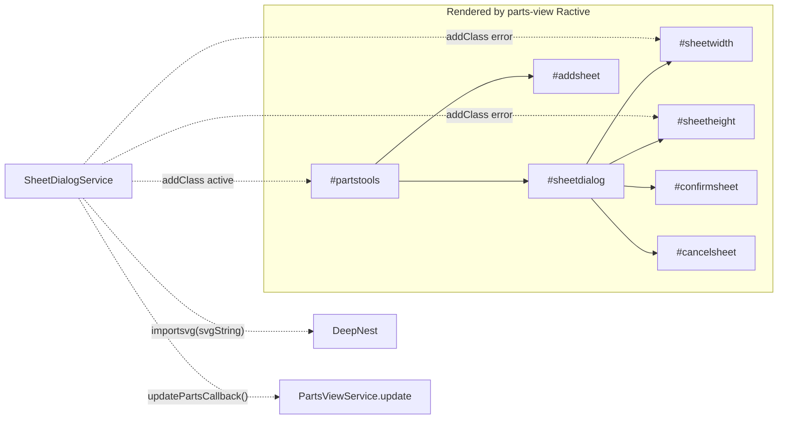
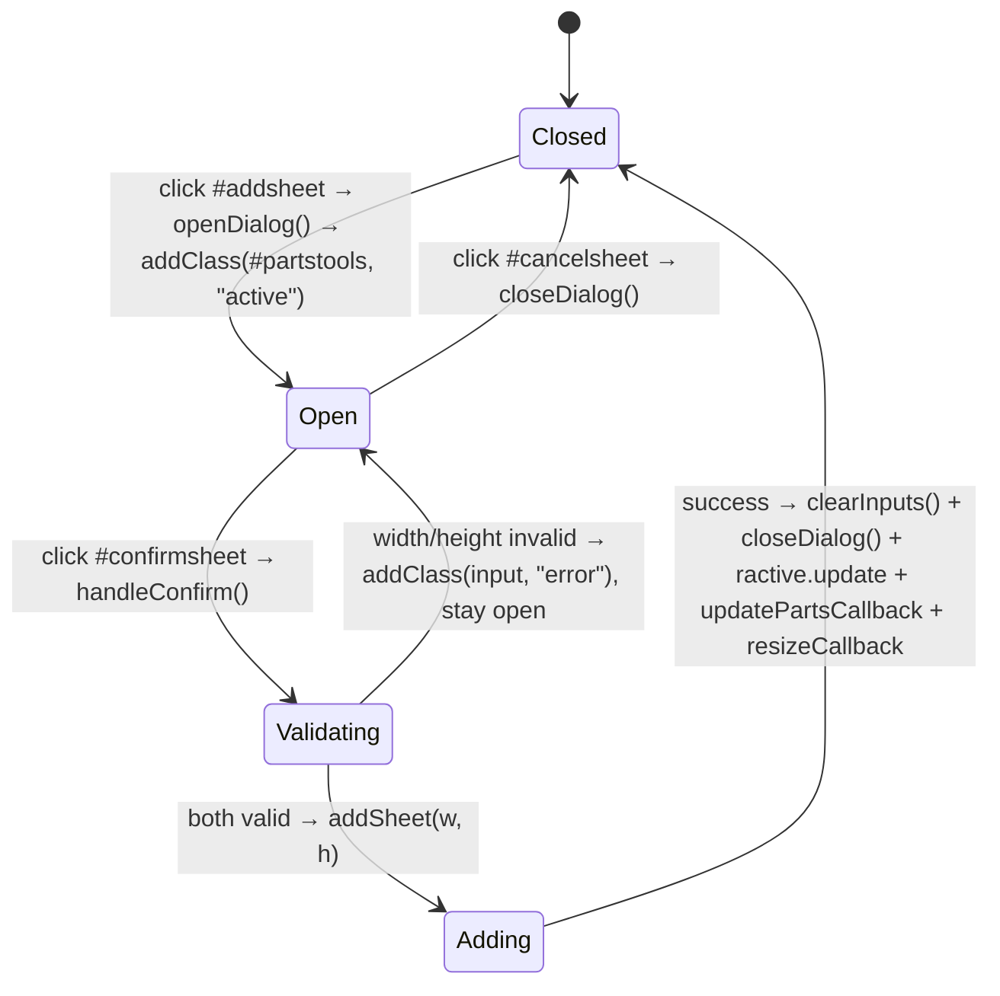

# `main/ui/components/sheet-dialog.ts` — Deep Dive

**Generated:** 2026-04-25 by Paige (Tech Writer) for [DEE-16](/DEE/issues/DEE-16) (parent: [DEE-11](/DEE/issues/DEE-11)).
**Group:** E — UI components.
**File:** `main/ui/components/sheet-dialog.ts` (437 LOC, TypeScript, strict).
**Mode:** Exhaustive deep-dive.

## Overview

The "Add Sheet" modal — the only way users add a rectangular sheet (bin) to the parts list. Reads width/height inputs in the user's current units (mm or inches), converts to internal SVG units, builds an in-memory `<svg><rect/></svg>`, and pushes it into `DeepNest.importsvg(...)` with `sheet = true`.

Crucially, **its DOM lives inside the `parts-view` Ractive template** (`#partstools` / `#sheetdialog`, declared in `#template-part-list`). The component does not own a Ractive instance of its own — it manipulates classes (`.active`, `.error`) on nodes that Ractive rendered into being. This is the second "shared DOM" foot-gun in Group E (the first is the `#partstools` toolbar).

Originally extracted from `page.js` lines 928–982.

## DOM contract (Group G)

| Surface | Selector | Owner | Notes |
|---|---|---|---|
| Open trigger | `#addsheet` | `SheetDialogService` | Click toggles `.active` on `#partstools`. The button itself is rendered by Ractive in `#template-part-list`. |
| Cancel button | `#cancelsheet` | `SheetDialogService` | Click closes (removes `.active`). |
| Confirm button | `#confirmsheet` | `SheetDialogService` | Click validates + adds. |
| Container (modal wrapper) | `#partstools` | **Shared** with `parts-view` (Ractive renders the markup, this component toggles `.active`) | Class `.active` reveals the modal via CSS. |
| Modal body | `#sheetdialog` | Static under `#partstools` | Pure CSS positioning, no JS owns it directly. |
| Width input | `#sheetwidth` | `SheetDialogService` | Validated, gets `.error` class on bad input. |
| Height input | `#sheetheight` | `SheetDialogService` | Same. |

There is **no Ractive template owned by this component**. The modal is part of `#template-part-list`, but the show/hide and validation logic live here.



## Public surface

```ts
class SheetDialogService {
  constructor(options: SheetDialogOptions);
  setRactive(ractive: RactiveInstance<PartsViewData>): void;
  setResizeCallback(callback: ResizeCallback): void;
  setUpdatePartsCallback(callback: UpdatePartsCallback): void;
  openDialog(): void;
  closeDialog(): void;
  addSheet(width: number, height: number): boolean;   // public — accepts user-unit values
  handleConfirm(): boolean | undefined;                // wired to #confirmsheet
  bindEventHandlers(): void;                            // idempotent
  initialize(): void;
  isOpen(): boolean;
  static create(options): SheetDialogService;
}
export function createSheetDialogService(options): SheetDialogService;
export function initializeSheetDialog(deepNest, config, ractive?, resizeCallback?): SheetDialogService;
```

`SheetDialogOptions`:

```ts
interface SheetDialogOptions {
  deepNest: DeepNestInstance;
  config: ConfigObject;
  ractive?: RactiveInstance<PartsViewData>;        // optional, alt to updatePartsCallback
  resizeCallback?: () => void;
  updatePartsCallback?: () => void;
}
```

## Modal lifecycle



## Validation rules

`validateInput(input)` (lines 192–200):

- Coerce `input.value` via `Number(...)`.
- Reject if `value <= 0` or `isNaN(value)`. The HTML5 `min="0"` attribute is **declared on the inputs** (`main/index.html` lines 173–174) but does NOT disable submit, so the JS guard is the only line of defence.
- On reject: add `.error` class. On accept: remove `.error`. The error class is the only user feedback (no inline message).

`addSheet(width, height)` (lines 248–267) re-validates `width <= 0 || height <= 0` defensively, even though `handleConfirm` already filtered. Calling `addSheet` programmatically with negative numbers is safe.

## Unit conversion

`getConversionFactor()` (lines 175–185):

```ts
const units = config.getSync("units");          // "mm" | "inch"
let conversion = config.getSync("scale");        // SVG units / inch
if (units === "mm") conversion /= INCHES_TO_MM; // 25.4
return conversion;
```

Then `addSheet(width, height)` does:

```ts
const svgWidth  = width  * conversion;
const svgHeight = height * conversion;
```

So if the user types **300 mm**, with a default `scale = 72` (SVG points/inch):

- `units = "mm"` ⇒ `conversion = 72 / 25.4 ≈ 2.835`
- `svgWidth = 300 * 2.835 = 850.4` SVG units.

The math matches the parts-view dimension label (`(25.4 * width / conversion).toFixed(1) + "mm"`) — they are inverse formulas.

## Returned data shape

`addSheet` builds an in-memory SVG via `createSheetSvg(svgWidth, svgHeight)` (lines 225–240):

```svg
<svg xmlns="...">
  <rect x="0" y="0" width="${svgWidth}" height="${svgHeight}" class="sheet"/>
</svg>
```

…then calls `deepNest.importsvg(null, null, svgString)` (line 260). The legacy importer parses the SVG, returns the new `Part[]` it appended to `deepNest.parts`. The component reads `parts[0]` and sets `sheet.sheet = true` (line 263) — the sheet flag is what marks it as a bin in the GA orchestrator.

`addSheet` returns `boolean` only — there is no public way to obtain the `Part` it created. `handleConfirm` returns `false | undefined` to fit the legacy event-handler return convention (false = preventDefault).

## Direct DOM manipulation that bypasses Ractive

This component is essentially **all** Ractive-bypass — it never holds a Ractive instance of its own. Specific issues:

- **`addClass(#partstools, "active")`** (line 156) and the matching `removeClass` (line 167) mutate a node that `parts-view`'s Ractive instance rendered. If the parts-view Ractive ever re-renders the `#partstools` element from scratch, the `.active` class is wiped silently. (In practice, parts-view only updates the `parts`/`imports` keypaths, never the toolbar markup, so this works.)
- **`addClass(input, "error")`** (lines 195, 198) on `#sheetwidth` / `#sheetheight`. Same caveat — these inputs live inside the parts-view template.
- **`createSheetSvg` uses `new XMLSerializer()`** (line 239) directly, bypassing the `dom-utils.serializeSvg` helper. Functionally equivalent, but inconsistent — consider unifying.
- **`getElement` calls everywhere** rather than caching node references — every confirm re-queries `#sheetwidth`/`#sheetheight`. Negligible perf impact, but means the component is robust to a Ractive re-render of the toolbar (the new nodes are picked up next click).

## Dependencies

| Import | Why |
|---|---|
| `../types/index.js` | `DeepNestInstance`, `ConfigObject`, `RactiveInstance`, `PartsViewData`. |
| `../utils/dom-utils.js` | `getElement`, `createSvgElement`, `setAttributes`, `addClass`, `removeClass`. |

No service consumed.

## Wired-in dependencies (from composition root)

`main/ui/index.ts:632`:

```ts
sheetDialogService = createSheetDialogService({
  deepNest: getDeepNest(),
  config: configService as unknown as ConfigObject,
  // Use updatePartsCallback instead of ractive to avoid type conflicts
  updatePartsCallback: () => partsViewService.update(),
  resizeCallback: resize,
});
sheetDialogService.initialize();
```

The composition root **deliberately uses `updatePartsCallback` instead of `ractive`** to avoid coupling the type signatures of `parts-view`'s ractive (which is `PartsViewRactiveInstance`, a private alias) to the broader `RactiveInstance<PartsViewData>` used here. The `ractive` option remains for callers who want to pass a typed ractive directly.

`updatePartsCallback` is invoked AFTER a successful `addSheet`, so the new sheet appears in the parts table.

## Side effects

| Trigger | Effect |
|---|---|
| Click `#addsheet` | `addClass(#partstools, "active")`. |
| Click `#cancelsheet` | `removeClass(#partstools, "active")`. |
| Click `#confirmsheet` (valid) | `deepNest.importsvg(...)` (mutates `deepNest.parts`), sets `sheet.sheet = true`, clears inputs, removes `.active`, fires `ractive.update("parts")` and/or `updatePartsCallback`, fires `resizeCallback`. |
| Click `#confirmsheet` (invalid) | Adds `.error` class to the offending input, dialog stays open. |

No IPC, no network, no `localStorage`.

## Error handling

`handleConfirm` returns early (`false`) if either input is missing or fails validation. If `deepNest.importsvg` throws, the exception propagates uncaught — there is no try/catch and no `message(...)` banner. In practice the legacy importer is forgiving and accepts the trivial single-`<rect>` SVG without complaint, but a future change to `importsvg` could regress this.

## Testing

- **Unit tests**: none. `validateInput`, `getConversionFactor`, `createSheetSvg`, and `addSheet` are pure (or near-pure) and would unit-test cleanly — current candidates if `tests/` ever grows a renderer-side suite.
- **E2E**: the Playwright "Add Sheet" interaction is covered indirectly (the sheet is required to start nesting). No assertion on conversion math beyond round-trip.

## Comments / TODOs in source

None. JSDoc throughout, no inline `TODO`/`FIXME`.

## Contributor checklist

**Risks & gotchas:**

- **DOM is borrowed from parts-view.** If you ever rewrite `parts-view` to re-render `#partstools` (e.g. by binding it into a `{{#if}}` block), this component's `.active` toggle will lose its target on each render. Move the modal markup out of the parts template if you need that flexibility.
- **No error reporting beyond `.error` class.** Users typing letters or `0` see a red border and silence. Consider wiring `message(...)` (from `ui-helpers.ts`) when validation fails repeatedly.
- **`new XMLSerializer()` direct usage.** Inconsistent with `dom-utils.serializeSvg`. Refactor candidate.
- **`addSheet` returns `boolean` not the new `Part`.** Callers cannot access the freshly-created sheet without scanning `deepNest.parts` for the latest `sheet === true && id` they didn't have before. Don't add features that need the new sheet handle without changing the return type.
- **Conversion math depends on `config.scale`.** If `scale` ever becomes 0 (corrupt user settings), this component will write `Infinity` widths. Guard upstream in `ConfigService`, not here.
- **`#partstools` is `addClass`/`removeClass`-toggled, not display: none.** CSS handles visibility — make sure new styles don't accidentally show the modal in non-`.active` state.
- **Confirm button does NOT disable** while a sheet is being created. Rapid double-click adds two sheets. Acceptable today (sheets are cheap), but worth knowing.

**Pre-change verification:**

- `npm run build`.
- `npm start`, switch units between mm and inch in Config, then add sheets in each unit. Confirm the resulting sheet bounds in the parts table match the typed dimensions.
- Type `0`, `-1`, and `abc` into width/height; confirm `.error` class appears and the dialog stays open.

**Suggested tests before PR:**

- `npm test` (Playwright).
- Manual unit-conversion sanity: with default `scale=72`, a 1 inch × 1 inch sheet should render with 72 SVG-unit bounds; a 25.4 mm × 25.4 mm sheet should produce the same `bounds.width`.

## Cross-references

- **Group D (services consumed):** none. **Pushes into:** `partsViewService.update()` (via `updatePartsCallback`) and `deepNest.importsvg` (legacy core, not a service).
- **Group F (composition root):** wired in `main/ui/index.ts:632`. The composition root chose `updatePartsCallback` over `ractive` deliberately — keep both options or document the deprecation.
- **Group G (`main/index.html`):** owns selectors `#addsheet`, `#cancelsheet`, `#confirmsheet`, `#sheetwidth`, `#sheetheight`. Manipulates `.active` on the parts-view-owned `#partstools`.
- **Component inventory:** `docs/component-inventory.md` row "SheetDialogService".
- **Architecture:** `docs/architecture.md` §3 (renderer composition).

---

_Generated by Paige for the Group E deep-dive on 2026-04-25. Sources: `main/ui/components/sheet-dialog.ts`, `main/ui/index.ts`, `main/index.html`._
