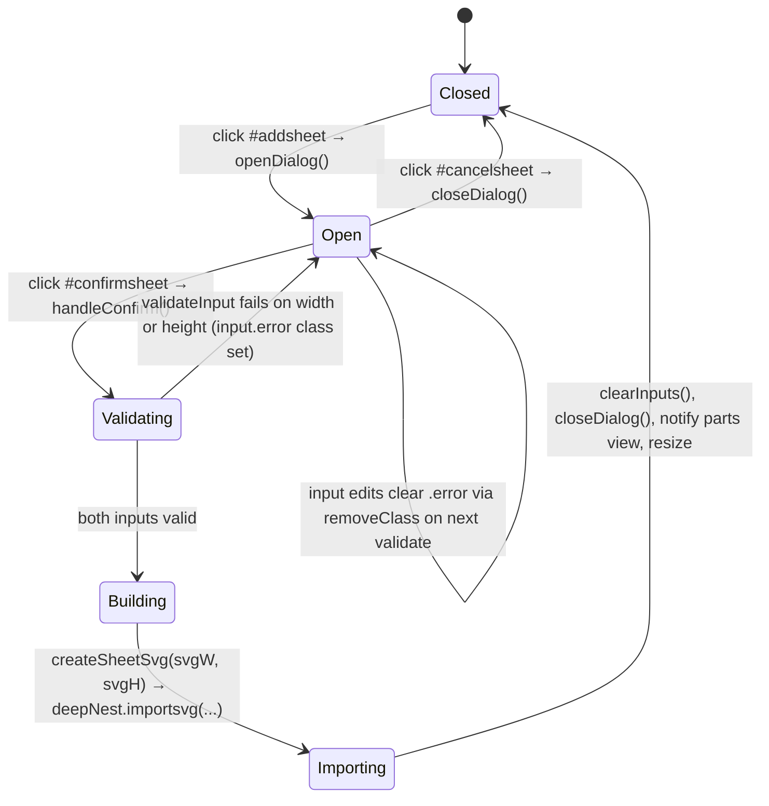

# `main/ui/components/sheet-dialog.ts` — Deep Dive

**Generated:** 2026-04-26 by Paige (Tech Writer) for [DEE-37](/DEE/issues/DEE-37) (parent: [DEE-11](/DEE/issues/DEE-11)).
**Group:** E — UI components.
**File:** `main/ui/components/sheet-dialog.ts` (436 LOC, TypeScript, strict).
**Mode:** Exhaustive deep-dive (full redo from source).

## 1. Purpose

The renderer's **add-sheet modal controller**. Owns:

1. The **show/hide state** of the inline sheet form (toggling
   `#partstools.active`).
2. **Validation + submit** of the width/height inputs (`#sheetwidth`,
   `#sheetheight`) plus the input-error class flip.
3. **Sheet construction** — synthesises an `<svg><rect/></svg>` of the
   correct (unit-aware) dimensions and hands it to
   `DeepNest.importsvg(...)` so the resulting "part" is treated as a
   sheet.

The component does **not** own a Ractive instance. The `#partstools`
markup is part of the parts-view template (Ractive owner:
[`PartsViewService`](./main__ui__components__parts-view.md)) but is
controlled imperatively here through CSS classes only.

The implementation is a 1:1 port of `page.js` lines 928–982 (legacy);
the JSDoc header at line 4 names the source. Behaviour parity is
intentional, so any divergence from the legacy renderer is a bug.

## 2. Public surface

```ts
export type ResizeCallback = () => void;
export type UpdatePartsCallback = () => void;

export interface SheetDialogOptions {
  deepNest: DeepNestInstance;                   // window.DeepNest
  config: ConfigObject;                         // window.config (= ConfigService)
  ractive?: RactiveInstance<PartsViewData>;     // optional — re-render parts list
  resizeCallback?: ResizeCallback;              // re-measure parts panel
  updatePartsCallback?: UpdatePartsCallback;    // alternative to `ractive`
}

export class SheetDialogService {
  constructor(options: SheetDialogOptions);

  setRactive(ractive: RactiveInstance<PartsViewData>): void;
  setResizeCallback(callback: ResizeCallback): void;
  setUpdatePartsCallback(callback: UpdatePartsCallback): void;

  openDialog(): void;                                // adds .active to #partstools
  closeDialog(): void;                               // removes .active
  isOpen(): boolean;                                 // reads #partstools.classList
  addSheet(width: number, height: number): boolean;  // imperative add (in user units)
  handleConfirm(): boolean | undefined;              // wired to #confirmsheet click
  bindEventHandlers(): void;                         // idempotent via `initialized`
  initialize(): void;                                // = bindEventHandlers
  static create(options: SheetDialogOptions): SheetDialogService;
}

export function createSheetDialogService(options: SheetDialogOptions): SheetDialogService;
export function initializeSheetDialog(
  deepNest: DeepNestInstance,
  config: ConfigObject,
  ractive?: RactiveInstance<PartsViewData>,
  resizeCallback?: ResizeCallback
): SheetDialogService;
```

`createSheetDialogService(...)` is the factory used by the composition
root (`main/ui/index.ts:632`); `initializeSheetDialog(...)` is a
one-liner helper currently unused in-tree.

The composition root passes `updatePartsCallback: () => partsViewService.update()`
rather than the `ractive` option (`index.ts:636`) — the in-line
comment at that line says: *"Use updatePartsCallback instead of
ractive to avoid type conflicts"*.

### 2.1 DOM contract (Group G)

| Surface | Selector / id | HTML line(s) | Notes |
|---|---|---|---|
| Open trigger | `#addsheet` | 167 | `<a class="button addsheet">`. Click handler bound at line 332. |
| Cancel button | `#cancelsheet` | 177 | Click handler bound at line 341. |
| Confirm button | `#confirmsheet` | 176 | Click handler bound at line 350. |
| Modal container | `#partstools` | 165 | `.active` toggles the modal. The same container also hosts the toolbar buttons (`#addsheet`, the delete button, `#selectall`) — only the inner `#sheetdialog` block (line 171) is the modal proper. |
| Width input | `#sheetwidth` | 173 | `<input type="number" min="0" required>`. Error class `error` flipped on validation failure. |
| Height input | `#sheetheight` | 174 | Same as width. |

Note: the `<form>` is implicit (the inputs are siblings inside
`#sheetdialog`, not inside a `<form>` element). `event.preventDefault()`
on the click handler (lines 333, 342, 351) is therefore an
abundance-of-caution call, since there is no form submit.

### 2.2 Lifecycle



Key lines:

- `bindEventHandlers()` (line 324) wires the three buttons; idempotent
  via `this.initialized` (lines 325–327).
- `validateInput(input)` (line 192) — fails for `value <= 0` or `NaN`.
  Adds `error` class on fail, removes on pass.
- `getConversionFactor()` (line 175) — reads `units` and `scale`
  synchronously from `ConfigService`. Returns `scale` when units are
  inches, `scale / 25.4` when units are mm. **The unit math is
  duplicated** here — see §5.
- `createSheetSvg(width, height)` (line 225) — builds an `<svg>` with
  one `<rect class="sheet" x="0" y="0" width="…" height="…"/>` and
  serialises it with `XMLSerializer` directly (not the
  `dom-utils.serializeSvg` helper). Functionally equivalent.
- `addSheet(width, height)` (line 248) — applies the conversion,
  builds the SVG, calls `deepNest.importsvg(null, null, svgString)`,
  flips the resulting part's `sheet` flag to `true`. Returns `false`
  for non-positive inputs (line 249) — the only failure path; SVG
  parse / `importsvg` returning empty is **not** validated.
- `handleConfirm()` (line 274) — composes validate → addSheet → side
  effects (clear, close, update parts list, resize). Returns `false`
  to signal "preventDefault" to legacy callers; the click handler
  also calls `event.preventDefault()` directly so the return value is
  not load-bearing.

## 3. IPC / global side-effects

| Trigger | Effect |
|---|---|
| `openDialog()` (line 153) | Adds `active` class to `#partstools`. |
| `closeDialog()` (line 164) | Removes `active` class from `#partstools`. |
| `validateInput()` | Adds/removes `error` class on the input. No focus change, no message banner. |
| `clearInputs()` (line 205) | Sets both inputs' `.value = ""`. Removes the `error` class from each. |
| `addSheet()` (line 248) | Calls `deepNest.importsvg(null, null, svgString)` (line 260). The `null, null, …` signature means: no file path, no callback, raw SVG body. Returns the `Part[]` array; the first entry is mutated to `sheet = true` (line 263). |
| `handleConfirm()` post-success | Calls `clearInputs()`, `closeDialog()`, `ractive?.update("parts")` (line 305), `updatePartsCallback?.()` (line 308), `resizeCallback?.()` (line 313). |
| Composition root (`index.ts:636`) | `updatePartsCallback` resolves to `() => partsViewService.update()`, which re-renders the parts table; `resizeCallback` resolves to the `resize()` hook. The `ractive` option is **not** wired in the composition root. |

**No** IPC channels and **no** network access. Reads
`config.getSync("units")` and `config.getSync("scale")` synchronously
(lines 176–177) — in-memory cache hits in `ConfigService`.

## 4. Dependencies

| Import | Why |
|---|---|
| `../types/index.js` (`DeepNestInstance`, `ConfigObject`, `RactiveInstance`, `PartsViewData`) | Type-only imports for the data model + Ractive seam. |
| `../utils/dom-utils.js` (`getElement`, `createSvgElement`, `setAttributes`, `addClass`, `removeClass`) | DOM access. |

The component does **not** import `serializeSvg` from `dom-utils` — it
calls `new XMLSerializer().serializeToString(svg)` directly at line
239. Functionally equivalent; the inconsistency is noted in §5.

The component does **not** import `INCHES_TO_MM` /
`getConversionFactor` from `main/ui/utils/conversion.ts`; instead it
declares its own `INCHES_TO_MM = 25.4` constant at line 54 and
re-implements the conversion in the private `getConversionFactor()`
method (lines 175–185). This is the third copy of the same logic in
the renderer (the others are in `parts-view.ts:235-249` and
`config.service.ts`'s `getConversionFactor()`).

### 4.1 Inbound dependencies (composition root)

`main/ui/index.ts:632-639`:

```ts
sheetDialogService = createSheetDialogService({
  deepNest: getDeepNest(),
  config: configService as unknown as ConfigObject,
  // Use updatePartsCallback instead of ractive to avoid type conflicts
  updatePartsCallback: () => partsViewService.update(),
  resizeCallback: resize,
});
sheetDialogService.initialize();
```

`index.ts:818-821` re-exports the service as a named binding for
external consumers (today: only the test surface).

### 4.2 Used-by

| Caller | Method | Line |
|---|---|---|
| `main/ui/index.ts` (composition root) | `initialize()` | 639 |
| (none other) | — | — |

The service is otherwise standalone — there is no other module that
calls `openDialog()` / `closeDialog()` / `addSheet(...)`.

## 5. Invariants & gotchas

- **Unit math is duplicated.** Lines 54 (`INCHES_TO_MM = 25.4`) and
  175–185 (`getConversionFactor`) re-implement what already exists in
  [`main/ui/utils/conversion.ts`](../f/main__ui__utils__conversion.ts.md)
  (`INCHES_TO_MM`, `getConversionFactor`). Same duplication exists in
  `parts-view.ts:235-249` and `ConfigService`. Refactor target: import
  `getConversionFactor` from `utils/conversion`.
- **`new XMLSerializer().serializeToString(svg)`** (line 239) bypasses
  the `dom-utils.serializeSvg` helper used elsewhere. Drop-in
  equivalent today; if `dom-utils.serializeSvg` ever grows policy
  (XML namespace fixups, sanitisation), this site will diverge.
- **`addSheet` returns `false` only on non-positive input** (line 249).
  If `deepNest.importsvg(null, null, svgString)` returns `[]` (parse
  error), the method still returns `true` and the caller proceeds to
  `closeDialog()` — the user sees no error but no sheet appears in
  the parts list. Defensive caller: re-render the parts panel via
  `updatePartsCallback`; if the count did not change, the import
  silently failed.
- **Validation is per-input, not global.** `handleConfirm()` returns
  `false` after the first failing input (line 285), so the height
  input is never validated when width is invalid. The user has to
  click Confirm twice to see both red borders.
- **`getElement<HTMLInputElement>(SHEET_WIDTH_INPUT)` reads the DOM
  every call** (lines 206, 207, 275, 276). The inputs live inside
  `#partstools`, which is part of a Ractive template that re-renders
  on every parts update — so caching the elements is unsafe. Don't
  refactor to module-level constants without first auditing whether
  Ractive ever re-renders `#sheetdialog`.
- **`bindEventHandlers()` is idempotent but additive.** Guarded by
  `this.initialized` (lines 325–327). No teardown — re-creating
  `#partstools` after init leaves stale listeners on detached nodes.
- **`closeDialog()` does not clear inputs.** Only `handleConfirm()`'s
  success branch clears (lines 299–301). Cancelling and re-opening
  the dialog preserves the previously-typed dimensions, which is
  almost always what users want — don't "fix" this without UX input.
- **Sheet is created with `class="sheet"` on the `<rect>`** (line
  234). After import, the entry's `sheet` property is set to `true`
  (line 263), which is the in-memory flag the parts view consults.
  The `class="sheet"` is preserved in the imported SVG and is what
  the nest-view uses to style sheet outlines (`#nestsvg .sheet`).
- **No SVG namespace declaration** — `createSvgElement("svg")` produces
  the right namespace URI in modern browsers (the helper sets
  `http://www.w3.org/2000/svg`); but the serialised string omits
  `xmlns="http://www.w3.org/2000/svg"`. `DeepNest.importsvg` accepts
  the namespace-less form via the SVG parser fallback. Don't
  hand-craft `<svg>` strings here without keeping the parser
  expectations in mind.
- **Width × height in user units** — `addSheet(300, 200)` with
  `units === "mm"` and `scale === 72` produces an SVG of
  `300 * (72 / 25.4)` × `200 * (72 / 25.4)` units. The number of SVG
  units changes if the user later switches `units`, but the SVG body
  is fixed at import time — switching units after the fact does not
  re-scale the sheet.
- **`event.preventDefault()` is called on click handlers but the
  buttons are anchors with `href="#"`** (HTML lines 167, 176, 177).
  Without `preventDefault`, clicking would scroll the page to the
  top.

## 6. Known TODOs

None in source. No `// TODO` or `// FIXME` markers.

Implicit TODOs surfaced by this deep dive (not in source):

- Replace local `INCHES_TO_MM` and `getConversionFactor()` with
  imports from `main/ui/utils/conversion.ts`.
- Surface a user-visible error (e.g. `message(...)` from
  `utils/ui-helpers`) when `deepNest.importsvg(...)` returns `[]`.
- Remove the `ractive` option (line 76 of the options interface) —
  the composition root has settled on `updatePartsCallback`.

## 7. Extension points

- **Pre-fill the dialog.** Set `widthInput.value` and
  `heightInput.value` after `openDialog()` to seed the inputs.
  No public method for this today; add one if pre-filling becomes
  common.
- **Add a third dimension (e.g. thickness).** Add the input to
  `#sheetdialog` (HTML line 171) and extend `validateInput` /
  `addSheet` with the new field. The constructor signature accepts
  arbitrary key/values via `SheetDialogOptions`.
- **Replace the rectangle with a parametric shape.** `createSheetSvg`
  (line 225) is the seam. The function currently emits one
  `<rect class="sheet">`; substitute any SVG element so long as the
  caller flips `sheet = true` on the resulting `Part`.
- **Hook into open/close events.** Today there is no callback for
  open/close transitions. If telemetry or an analytics counter is
  needed, decorate `openDialog()` / `closeDialog()` in a subclass or
  wrap the methods at composition time.

## 8. Test coverage

- **Unit tests:** none in repo. Renderer UI is covered exclusively by
  Playwright E2E tests; see
  [`docs/deep-dive/j/tests__index.spec.ts.md`](../j/tests__index.spec.ts.md)
  and `docs/architecture.md` §6.
- **E2E coverage:** the import-and-nest spec exercises sheet
  creation indirectly (existing fixtures already include a sheet
  part). There is no dedicated `sheet-dialog.spec.ts` — manual
  verification is the smoke path today.
- **Manual verification checklist:**
  1. Click `#addsheet` → modal opens (`#partstools` gains `active`).
  2. Type `0` in width → click Add → width input shows `error`,
     dialog stays open.
  3. Fix width to `300`, leave height blank → click Add → height
     input shows `error`, dialog stays open.
  4. Type `200` in height → click Add → dialog closes, parts list
     shows a new sheet entry with the right dimension label.
  5. Click `#cancelsheet` → modal closes; reopen → previously-typed
     values are preserved (intentional).
  6. Switch units in `#config` (mm ↔ inch) and add a sheet — confirm
     the conversion math: `inch=300, scale=72` → `300*72=21600` SVG
     units; `mm=300, scale=72` → `300*72/25.4 ≈ 850.39` SVG units.

## 9. Cross-references

- **Group D (services):**
  - [`config.service.ts`](../d/main__ui__services__config.service.md)
    is queried for `units` and `scale`.
  - `DeepNest.importsvg` (legacy module
    [`docs/deep-dive/b/main__deepnest.js.md`](../b/main__deepnest.js.md))
    is the actual import sink.
- **Group E peers:**
  - [`parts-view.ts`](./main__ui__components__parts-view.md) owns
    the Ractive instance whose `#partstools` markup this dialog
    controls; the post-confirm callback re-renders the parts list.
  - [`navigation.ts`](./main__ui__components__navigation.md) shares
    the `resizeCallback` seam (the same `resize()` hook).
- **Group F (utilities):**
  [`dom-utils.ts`](../f/main__ui__utils__dom-utils.ts.md),
  [`conversion.ts`](../f/main__ui__utils__conversion.ts.md) (the
  refactor target for the duplicated unit math).
- **Group G (`main/index.html`):** owner of `#addsheet`, `#cancelsheet`,
  `#confirmsheet`, `#partstools`, `#sheetwidth`, `#sheetheight`. See
  [`docs/deep-dive/g/main__index.html.md`](../g/main__index.html.md).
- **Composition root:** [`main/ui/index.ts`](../c/main__ui__index.ts.md) §6.
- **Component inventory:** [`docs/component-inventory.md`](../../component-inventory.md)
  row "SheetDialogService".
- **Architecture:** [`docs/architecture.md`](../../architecture.md) §3
  (renderer composition).
